# Pipeline Summary - AI Agent Starter

## 📦 Complete CI/CD Pipeline Suite

This project includes 7 comprehensive GitHub Actions workflows for automated building, testing, deployment, and infrastructure management.

---

## 🔨 Build & Test Pipelines

### 1. **Build Pipeline** (`build.yml`)
**Purpose:** Continuous Integration - Test and validate code quality

**Triggers:**
- Push to any branch
- Pull requests

**What it does:**
- ✅ Tests on Python 3.10, 3.11, 3.12
- 🔍 Linting with flake8, black, mypy
- 🧪 Unit tests with pytest
- 📊 Coverage reporting (uploads to Codecov)
- 🛡️ Security scanning with safety & bandit
- 📈 SARIF results for GitHub Security

**When to use:** Automatic on every commit

---

### 2. **PR Validation** (`pr-validation.yml`)
**Purpose:** Quality gates for pull requests

**Triggers:**
- Pull request opened/updated

**What it does:**
- ✅ All build checks must pass
- 📊 Coverage threshold enforcement
- 🔒 Security scan results reviewed
- 🎨 Code formatting validation

**When to use:** Automatic on PRs

---

## 🏗️ Infrastructure Pipelines

### 3. **Infrastructure Deploy** (`infra-deploy.yml`) ⭐ NEW!
**Purpose:** Deploy Azure infrastructure using Bicep IaC

**Triggers:**
- Manual workflow dispatch (choose environment)
- Push to `main` when `infra/**` files change

**What it deploys:**
- 📦 Azure Container Registry
- 🏢 Container Apps Environment
- 🐳 Container App (with managed identity)
- 📊 Log Analytics Workspace
- 📈 Application Insights

**Workflow Steps:**
1. **Validate** - Validates Bicep template syntax
2. **What-if** - Shows what will change
3. **Deploy** - Creates Azure resources
4. **Configure** - Sets up managed identity & permissions
5. **Verify** - Tests health endpoint
6. **Output** - Generates deployment info

**Environments:**
- **dev** - 0.5 CPU, 1GB RAM, scales to zero (~$40-80/mo)
- **staging** - 1.0 CPU, 2GB RAM, 1-5 replicas (~$80-150/mo)
- **production** - 2.0 CPU, 4GB RAM, 2-10 replicas, zone redundant (~$200-400/mo)

**Actions:**
- `deploy` - Create/update infrastructure
- `destroy` - Delete all resources in environment

**Cost Estimation:** Included in workflow output

**When to use:**
```bash
# First time setup for each environment
Actions → Infrastructure - Deploy to Azure
   → Run workflow
   → Select environment: dev/staging/production
   → Select action: deploy
```

**Outputs:**
- Container App URL
- Container Registry name
- Managed Identity IDs
- Log Analytics Workspace ID
- Application Insights connection string

---

## 🚀 Application Deployment Pipelines

### 4. **Application Deploy** (`deploy.yml`)
**Purpose:** Deploy application to Azure Container Apps

**Triggers:**
- Push to `main` branch
- Manual workflow dispatch

**What it does:**
- 🐳 Build Docker image
- 📦 Push to Azure Container Registry
- 🚀 Deploy to Container Apps
- 🏥 Health check `/health` endpoint
- 💬 Comment deployment URL on commit
- ⚠️ **Automatic rollback** on failure

**Rollback Mechanism:**
- Monitors health checks
- If deployment fails, automatically activates previous revision
- Preserves service availability

**Prerequisites:**
- Infrastructure must be deployed first
- GitHub secrets must be configured:
  - `AZURE_CREDENTIALS`
  - `AZURE_PROJECT_ENDPOINT`
  - `MODEL_DEPLOYMENT_NAME`
  - `AZURE_CONTAINER_REGISTRY`
  - `AZURE_RESOURCE_GROUP`
  - `AZURE_CONTAINER_APP_NAME`

**When to use:** Automatic on push to main, or manual trigger

---

### 5. **Docker Build** (`docker.yml`)
**Purpose:** Build and publish Docker images to GHCR

**Triggers:**
- Push to `main`
- New releases/tags
- Manual dispatch

**What it does:**
- 🐳 Multi-platform build (linux/amd64, linux/arm64)
- 🔒 Trivy security scanning
- 📦 Push to GitHub Container Registry
- 🏷️ Tags: latest, commit SHA, version tags

**When to use:** Automatic, or for custom Docker image builds

---

## 🔄 Maintenance Pipelines

### 6. **Dependencies** (`dependencies.yml`)
**Purpose:** Automated dependency management

**Triggers:**
- Weekly schedule (Mondays at 9 AM)
- Manual dispatch

**What it does:**
- 🔄 Checks for outdated dependencies
- 🔐 Scans for security vulnerabilities
- 📊 Generates dependency reports
- 🤖 Can create PRs for updates (with Dependabot)

**When to use:** Automatic weekly

---

### 7. **Release** (`release.yml`)
**Purpose:** Automated release process

**Triggers:**
- Push tags matching `v*.*.*`
- Manual dispatch

**What it does:**
- 🏷️ Created versioned release
- 📝 Auto-generates changelog from commits
- 📦 Packages release assets
- 🚀 Publishes release notes

**When to use:**
```bash
# Create new release
git tag v1.0.0
git push origin v1.0.0
```

---

## 🎯 Deployment Flow

### First Time Setup

```mermaid
graph TD
    A[1. Fork/Clone Repo] --> B[2. Configure GitHub Secrets]
    B --> C[3. Run Infrastructure Deploy]
    C --> D[4. Copy Outputs to Secrets]
    D --> E[5. Run Application Deploy]
    E --> F[6. Verify Health Check]
    F --> G[✅ Application Live]
```



### Continuous Deployment

```mermaid
graph TD
    A[Developer Pushes Code] --> B[Build Pipeline Runs]
    B --> C{Tests Pass?}
    C -->|No| D[❌ Build Fails]
    C -->|Yes| E[Build Docker Image]
    E --> F[Push to ACR]
    F --> G[Deploy to Container Apps]
    G --> H{Health Check}
    H -->|Pass| I[✅ Deployment Success]
    H -->|Fail| J[⚠️ Auto Rollback]
    J --> K[Activate Previous Revision]
```



---

## 📋 Required GitHub Secrets

### For Infrastructure Deployment
```bash
AZURE_CREDENTIALS              # Service principal JSON
AZURE_PROJECT_ENDPOINT         # Azure AI/OpenAI endpoint
MODEL_DEPLOYMENT_NAME          # Model deployment name (e.g., gpt-4)
```

### For Application Deployment
```bash
# Copy from infrastructure deployment outputs:
AZURE_CONTAINER_REGISTRY       # From: containerRegistryName
AZURE_RESOURCE_GROUP          # Your resource group name
AZURE_CONTAINER_APP_NAME      # Format: ai-agent-starter-{env}
```

### Setting Secrets
```bash
# Via GitHub UI
Repository → Settings → Secrets and variables → Actions → New repository secret

# Via GitHub CLI
gh secret set AZURE_CREDENTIALS < azure-creds.json
gh secret set AZURE_PROJECT_ENDPOINT --body "https://your-endpoint.openai.azure.com"
gh secret set MODEL_DEPLOYMENT_NAME --body "gpt-4"
```

---

## 🎬 Quick Start Commands

### Deploy Full Stack (First Time)

```bash
# 1. Deploy infrastructure (via GitHub Actions UI)
#    Actions → Infrastructure - Deploy to Azure
#    Environment: dev, Action: deploy

# 2. Get outputs and configure secrets
az deployment group show \
  --name your-deployment-name \
  --resource-group ai-agent-starter-dev-rg \
  --query properties.outputs

# 3. Configure secrets (see above)

# 4. Deploy application
#    Actions → CD - Deploy to Azure Container Apps
#    Click: Run workflow
```

### Update Application (After Setup)

```bash
# Simply push to main - automatic deployment
git add .
git commit -m "feat: add new feature"
git push origin main

# Deployment happens automatically with rollback protection
```

### Monitor Deployment

```bash
# Follow deployment in GitHub Actions
#    Actions → CD - Deploy to Azure Container Apps

# View live logs in Azure
az containerapp logs show \
  --name ai-agent-starter-dev \
  --resource-group ai-agent-starter-dev-rg \
  --follow

# Check health
curl https://your-app.azurecontainerapps.io/health
```

---

## 💰 Cost Breakdown by Environment

### Development
- **Container App:** $40-60/month (scales to zero)
- **Container Registry:** $5/month (Basic)
- **Log Analytics:** $10-20/month
- **Total:** ~$55-85/month
- **Can scale to $0** when not in use (minReplicas: 0)

### Staging
- **Container App:** $60-100/month (1 replica minimum)
- **Container Registry:** $5/month (Basic)
- **Log Analytics:** $15-30/month
- **Application Insights:** $5-10/month
- **Total:** ~$85-145/month

### Production
- **Container App:** $150-300/month (2+ replicas, zone redundant)
- **Container Registry:** $20/month (Standard)
- **Log Analytics:** $30-60/month
- **Application Insights:** $10-30/month
- **Total:** ~$210-410/month

---

## 🛡️ Security Features

### Build Security
- 🔒 Bandit - Python security linting
- 🛡️ Safety - Dependency vulnerability scanning
- 📊 SARIF reports for GitHub Security

### Container Security
- 🔍 Trivy - Container image scanning
- 🔐 Managed Identity - No stored credentials
- 🏷️ Image signing (optional)

### Deployment Security
- 🔑 Azure RBAC - Role-based access control
- 🔒 Secrets in Key Vault (optional)
- 🌐 Private endpoints (configurable)
- 📝 Audit logging enabled

---

## 📚 Documentation Links

| Topic | Link |
|-------|------|
| **Infrastructure Overview** | [infra/README.md](../infra/README.md) |
| **Quick Deploy Guide** | [infra/QUICKSTART.md](../infra/QUICKSTART.md) |
| **Bicep Template** | [infra/main.bicep](../infra/main.bicep) |
| **Azure Container Apps Setup** | [docs/AZURE_CONTAINER_APPS_SETUP.md](../docs/AZURE_CONTAINER_APPS_SETUP.md) |
| **Main README** | [README.md](../README.md) |

---

## 🆘 Troubleshooting

### Infrastructure Deployment Fails
```bash
# Check validation step
az bicep build --file infra/main.bicep

# Check what-if results
az deployment group what-if \
  --resource-group ai-agent-starter-dev-rg \
  --template-file infra/main.bicep \
  --parameters @infra/dev.parameters.json
```

### Application Deployment Fails
```bash
# Check container logs
az containerapp logs show \
  --name ai-agent-starter-dev \
  --resource-group ai-agent-starter-dev-rg

# Check revision status
az containerapp revision list \
  --name ai-agent-starter-dev \
  --resource-group ai-agent-starter-dev-rg

# Manual rollback if needed
az containerapp revision activate \
  --name ai-agent-starter-dev \
  --resource-group ai-agent-starter-dev-rg \
  --revision previous-revision-name
```

### GitHub Actions Stuck
```bash
# Cancel workflow
gh run cancel <run-id>

# Re-run workflow
gh run rerun <run-id>

# View workflow logs
gh run view <run-id> --log
```

---

## ✅ Pipeline Health Checklist

- [ ] All build tests passing
- [ ] Security scans show no critical issues
- [ ] Infrastructure deployed successfully
- [ ] Application deployment successful
- [ ] Health checks passing
- [ ] Logs visible in Log Analytics
- [ ] Application Insights collecting data
- [ ] Container registry accessible
- [ ] Managed identity configured
- [ ] Costs within budget

---

## 🎉 Success Indicators

✅ **Build Pipeline:** Green checkmark on commits
✅ **Infrastructure:** Resources visible in Azure Portal
✅ **Application:** Health endpoint returns 200 OK
✅ **Monitoring:** Logs flowing to Log Analytics
✅ **API:** Swagger docs accessible at `/docs`
✅ **Chat:** `/agent_chat` endpoint responding

---

**Ready to deploy?** Start with [Infrastructure Quick Start](../infra/QUICKSTART.md)!
