# AI Agent Starter


## �️ Architecture with User Proxy Pattern

The system implements a **User Proxy Agent** pattern for enhanced conversation management:

```mermaid
graph TD
    User["👤 User"] --> Proxy["🤖 User Proxy Agent<br/>• Clarification Handling<br/>• Context Management<br/>• Response Formatting<br/>• Command Processing"]
    
    Proxy --> Orchestrator["🎯 Orchestrator<br/>• Keyword-based<br/>• LLM-powered<br/>• Rule-based"]
    
    Orchestrator --> GithubAgent["🔧 GitHub Agent<br/>• Repository Management<br/>• File Operations<br/>• Issue Creation"]
    
    Orchestrator --> MathAgent["🔢 Math Agent<br/>• Arithmetic<br/>• Expression Evaluation<br/>• Calculations"]
    
    Orchestrator --> OtherAgents["... Future Agents<br/>• Elasticsearch<br/>• ServiceNow<br/>• Custom Agents"]
    
    GithubAgent --> GithubTools["GitHub API"]
    MathAgent --> MathTools["Math Operations"]
    OtherAgents --> OtherTools["Various APIs"]
    
    GithubTools --> Response["📤 Response"]
    MathTools --> Response
    OtherTools --> Response
    
    Response --> Proxy
    Proxy --> EnhancedResponse["✨ Enhanced Response<br/>• Agent Info<br/>• Follow-up Suggestions<br/>• Formatted Output"]
    EnhancedResponse --> User
    
    style Proxy fill:#e1f5ff,stroke:#01579b,stroke-width:3px
    style User fill:#fff9c4,stroke:#f57f17,stroke-width:2px
    style EnhancedResponse fill:#c8e6c9,stroke:#2e7d32,stroke-width:2px
    style Orchestrator fill:#f3e5f5,stroke:#4a148c,stroke-width:2px
```



### Key Benefits

- **🤔 Intelligent Clarification:** Detects ambiguous queries and asks for details
- **💾 Context Management:** Remembers user preferences and conversation history
- **✨ Enhanced Responses:** Adds agent routing info and follow-up suggestions
- **⚡ Command System:** Built-in commands (help, status, clear, preferences)
- **👥 Multi-Session Support:** Isolated contexts for different users (API mode)

**See:** [User Proxy Pattern Documentation](docs/USER_PROXY_PATTERN.md) | [Quick Start Guide](USER_PROXY_QUICKSTART.md)

## �🆕 Two Implementation Options

### 1. **Semantic Kernel (Recommended) - NEW!** ✨

The modern implementation using Microsoft's Semantic Kernel framework.

**Benefits:**
- Simpler, more maintainable code
- Native Azure OpenAI integration
- Built-in async support
- Automatic function calling
- Easier plugin development

**Run with:**
```bash
python chat_sk.py
```

**Learn more:** See [SEMANTIC_KERNEL_MIGRATION.md](SEMANTIC_KERNEL_MIGRATION.md)

### 2. **LangGraph (Legacy)**

The original implementation using LangGraph's state management system.

**Run with:**
```bash
python chat.py
```

## �️ Orchestration Strategies

The Semantic Kernel implementation supports three different agent orchestration strategies for intelligent routing:

### 1. **KeywordOrchestrator** - Simple & Fast 🚀

**Strategy:** Simple keyword matching against predefined agent domain keywords

**Pros:**
- ⚡ Very fast routing (no LLM calls)
- 🎯 Predictable and deterministic
- 🛠️ Easy to debug and understand
- 💰 No additional API costs

**Best For:** High-volume environments, predictable query patterns, cost-conscious deployments

**Example Routing:**
```bash
"show github repositories" → GitHub Agent (matches: github, repositories)
"find error logs" → Elasticsearch Agent (matches: error, logs)
"create incident" → ServiceNow Agent (matches: create, incident)
```

**Run with:**
```bash
python chat_multi_agent.py  # Uses KeywordOrchestrator by default
```

### 2. **RuleBasedOrchestrator** - Business Logic 🏢

**Strategy:** Priority-ordered business rules with complex conditional logic

**Features:**
- 📋 Priority-based rule ordering (100+ = Critical, 50-99 = Medium, 1-49 = Fallback)
- 🧠 Business context-aware routing
- ⚖️ Complex conditional logic support
- 📊 Auditable and configurable decisions

**Example Rules:**
```python
"critical incident + outage" → ServiceNow (Priority 100)
"analyze + code" → GitHub (Priority 90) 
"error + logs" → Elasticsearch (Priority 90)
```

**Best For:** Enterprise environments, complex business logic, auditable routing decisions

### 3. **LLMOrchestrator** - AI Intelligence 🧠

**Strategy:** Uses dedicated LLM instance for intelligent routing decisions

**Features:**
- 🎯 Understands user intent and context
- 🌐 Natural language understanding
- 🔄 Handles complex/ambiguous queries
- 🎛️ Low temperature (0.1) for consistent routing
- ⬇️ Fallback to keyword matching on failure

**Example Intelligence:**
```bash
"Help me understand why login is failing" → Elasticsearch (intent: troubleshoot)
"Review the authentication logic" → GitHub (intent: code review)
"Critical issue affecting users" → ServiceNow (intent: incident management)
```

**Best For:** Complex queries, natural language environments, unpredictable query patterns

### Orchestrator Comparison

| Feature | Keyword | Rule-Based | LLM |
|---------|---------|------------|-----|
| **Speed** | ⚡ Fastest | 🚀 Fast | 🐌 Slower |
| **Intelligence** | 📊 Basic | 🧠 Smart | 🎯 Intelligent |
| **Cost** | 💰 Free | 💰 Free | 💸 API Costs |
| **Maintenance** | ✅ Low | 🛠️ Medium | ✅ Low |
| **Predictability** | 🎯 High | 🎯 High | ⚡ Medium |
| **Flexibility** | 📊 Low | 🔧 High | 🌟 Very High |

### Switching Orchestrators

To use different orchestrators, modify the import in `chat_multi_agent.py`:

```python
# For keyword-based routing (default)
from orchestrators import KeywordOrchestrator
orchestrator = KeywordOrchestrator()

# For rule-based routing
from orchestrators import RuleBasedOrchestrator  
orchestrator = RuleBasedOrchestrator()

# For LLM-powered routing
from orchestrators import LLMOrchestrator
orchestrator = LLMOrchestrator()
```

## ☁️ Microsoft Agent Framework Architecture

The agents in this project are built using **Microsoft Agent Framework** and connect to AI models hosted in **Azure AI Foundry** projects. This provides a modern, scalable architecture for building AI agents.

### Agent Implementation

All agents use Microsoft Agent Framework with Azure AI integration:

```
agents/
├── __init__.py
├── math_agent.py           # Math calculations agent
└── github_agent.py         # GitHub operations agent
```

### Azure AI Foundry Connection

The agents connect to models deployed in your Azure AI Foundry project:

| Component | Purpose |
|-----------|---------|
| **Microsoft Agent Framework** | SDK for building conversational AI agents |
| **Azure AI Foundry** | Cloud platform hosting your AI models and projects |
| **Azure AI Project** | Workspace containing model deployments and configurations |
| **Model Deployment** | Your specific GPT model (e.g., gpt-4.1) in the project |

### Configuration

Add your Azure AI Project details to `.env`:

```bash
# Azure AI Project Configuration
AZURE_PROJECT_ENDPOINT=https://your-project.services.ai.azure.com/api/projects/your-project
MODEL_DEPLOYMENT_NAME=gpt-4.1
```

### Requirements

The Microsoft Agent Framework dependencies are in `requirements.txt`:

```bash
azure-ai-projects>=2.0.0b1
azure-identity
agent-framework
```

### Agent Structure

Each agent uses Microsoft Agent Framework's `ChatAgent` class:

```python
from agent_framework.azure import AzureAIClient
from agent_framework import ChatAgent

# Create client connecting to your AI Foundry project
client = AzureAIClient(
    project_endpoint=os.getenv('AZURE_PROJECT_ENDPOINT'),
    model_deployment_name=os.getenv('MODEL_DEPLOYMENT_NAME'),
    credential=DefaultAzureCredential()
)

# Create agent with tools and instructions
agent = client.create_agent(
    name="MathAgent",
    instructions="You are a specialized math assistant...",
    tools=[add, subtract, multiply, divide]
)
```

### Creating New Agents

To create a new agent with Microsoft Agent Framework:

```python
import os
from azure.identity.aio import DefaultAzureCredential
from agent_framework.azure import AzureAIClient
from agent_framework import ChatAgent

async def create_custom_agent() -> ChatAgent:
    """Create a custom agent with specific tools and instructions."""
    
    # Get Azure AI Project configuration from environment
    project_endpoint = os.getenv('AZURE_PROJECT_ENDPOINT')
    model_deployment_name = os.getenv('MODEL_DEPLOYMENT_NAME', 'gpt-4.1')
    
    # Create Azure AI client with managed identity
    credential = DefaultAzureCredential()
    client = AzureAIClient(
        project_endpoint=project_endpoint,
        model_deployment_name=model_deployment_name,
        credential=credential
    )
    
    # Define agent instructions (system prompt)
    instructions = """You are a helpful assistant specialized in...
    - Skill 1
    - Skill 2
    - Skill 3
    """
    
    # Define tools the agent can call
    def custom_tool(param: str) -> str:
        """Tool description for the agent."""
        return f"Result: {param}"
    
    # Create agent with tools
    agent = client.create_agent(
        name="CustomAgent",
        instructions=instructions,
        tools=[custom_tool]
    )
    
    return agent

# Use the agent
agent = await create_custom_agent()
response = await client.run_chat(agent, "user message")
```

### Benefits of Microsoft Agent Framework

- ✅ **Native Azure Integration**: Direct connection to Azure AI Foundry projects
- ✅ **Tool Support**: Easy integration of Python functions as agent tools
- ✅ **Managed Identity**: Secure authentication without storing credentials
- ✅ **Async/Await**: Modern Python async support for concurrent operations
- ✅ **Type Safety**: Full Python type hints and IDE autocompletion
- ✅ **Scalable**: Containerized deployment to Azure Container Apps
- ✅ **Cost Effective**: Pay only for model inference, not agent orchestration
## 🏗️ Architecture

### Multi-Agent Architecture

The solution uses Microsoft Agent Framework with multi-agent orchestration:

```mermaid
graph TB
    subgraph "User Interface Layer"
        UI[🖥️ Chat Interface<br/>chat.py / main.py]
    end
    
    subgraph "Orchestration Layer"
        ORCH[🎯 Keyword Orchestrator<br/>Routes to specialized agents]
        LLM[🤖 LLM Orchestrator<br/>AI-based routing]
    end
    
    subgraph "Agent Layer - Microsoft Agent Framework"
        MATH[🔢 Math Agent<br/>Calculations & formulas]
        GH[📦 GitHub Agent<br/>Repository operations]
    end
    
    subgraph "Tools Layer"
        MT[Math Tools<br/>add, subtract, multiply, divide]
        GT[GitHub Tools<br/>repos, files, issues]
    end
    
    subgraph "Azure AI Foundry"
        PROJ[AI Project<br/>Project Endpoint]
        MODEL[Model Deployment<br/>GPT-4.1 / GPT-4.1]
    end
    
    UI --> ORCH
    ORCH --> MATH
    ORCH --> GH
    MATH --> MT
    GH --> GT
    MATH -.connects via AzureAIClient.-> PROJ
    GH -.connects via AzureAIClient.-> PROJ
    PROJ --> MODEL
    
    classDef userLayer fill:#e1f5fe,stroke:#01579b,stroke-width:2px
    classDef orchLayer fill:#f3e5f5,stroke:#4a148c,stroke-width:2px
    classDef agentLayer fill:#e8f5e8,stroke:#1b5e20,stroke-width:2px
    classDef toolLayer fill:#fff3e0,stroke:#e65100,stroke-width:2px
    classDef azureLayer fill:#ffebee,stroke:#b71c1c,stroke-width:2px
    
    class UI userLayer
    class ORCH,LLM orchLayer
    class MATH,GH agentLayer
    class MT,GT toolLayer
    class PROJ,MODEL azureLayer
```



### Data Flow Architecture

```mermaid
sequenceDiagram
    participant U as 👤 User
    participant C as 🖥️ Chat Interface
    participant O as 🎯 Orchestrator
    participant M as 🔢 Math Agent
    participant T as ⚙️ Math Tools
    participant F as 🌐 Azure AI Foundry
    
    U->>C: "What is 15 times 23?"
    C->>O: Process user message
    O->>O: Detect keywords<br/>"times" → Math domain
    O->>M: Route to Math Agent
    M->>F: Send to GPT-4.1<br/>(with tool definitions)
    F->>F: Agent decides to call<br/>multiply(15, 23)
    F->>T: Execute multiply tool
    T->>F: Return: 345
    F->>M: AI response with result
    M->>O: "15 times 23 equals 345"
    O->>C: Format response
    C->>U: "15 times 23 equals 345"
```



### Key Architectural Patterns

**1. Multi-Agent Orchestration**
- Keyword-based routing to specialized agents (keyword_orchestrator.py)
- LLM-based intelligent routing (llm_orchestrator.py)
- Each agent has domain-specific tools and instructions
- Agents can be developed and tested independently

**2. Microsoft Agent Framework Integration**
- All agents use `agent_framework.azure.AzureAIClient`
- Connect to models in Azure AI Foundry projects
- Managed identity authentication (no API keys in code)
- Native tool calling support with Python functions

**3. Azure AI Foundry Connection**
- Project endpoint from `AZURE_PROJECT_ENDPOINT` environment variable
- Model deployment name from `MODEL_DEPLOYMENT_NAME` (e.g., "gpt-4.1")
- Centralized model management and monitoring
- Cost tracking per project

## 🔧 Technical Stack

### Core Technologies
- **Microsoft Agent Framework**: SDK for building conversational AI agents
- **Azure AI Foundry**: Cloud platform for AI project management and model hosting
- **Python 3.12**: Modern async/await support and type hints

### Integrations
- **GitHub API**: Repository browsing, file content access, issue creation
- **PyGithub**: Python wrapper for GitHub API operations

### Infrastructure
- **Azure Container Apps**: Serverless container hosting with autoscaling
- **Azure Container Registry**: Private Docker image storage
- **Azure Log Analytics**: Centralized logging and monitoring
- **Azure Application Insights**: Performance monitoring and diagnostics
- **Docker**: Containerized application deployment
- **GitHub Actions**: CI/CD pipelines for build, push, and deploy

## 🚀 Capabilities

### Math Agent
The Math Agent provides calculation capabilities:

**Operations:**
- Addition, subtraction, multiplication, division
- Formula evaluation
- Multi-step calculations

### GitHub Integration
The GitHub Agent provides repository management:

**Repository Operations:**
- List all repositories for a given user
- Browse repository file structures
- Access and display file contents
- Create issues with detailed descriptions

**Code Analysis:**
- Search through repository contents
- Analyze code patterns and structures
- Provide insights into application architecture

### Elasticsearch Integration
Advanced log analysis capabilities with structured querying:

**Log Search Features:**
- KQL (Kibana Query Language) support for precise log filtering
- Multi-field search across log attributes (levelname, message, host, timestamp)
- Structured log parsing for Python applications

**Supported Log Fields:**
```json
{
  "exc_info": "Exception information",
  "exc_text": "Exception text details", 
  "filename": "Source file name",
  "funcName": "Function name where log originated",
  "host": "Server hostname",
  "host_ip": "Server IP address",
  "levelname": "Log level (ERROR, INFO, WARNING, etc.)",
  "lineno": "Line number in source code",
  "message": "Log message content",
  "module": "Python module name",
  "pathname": "Full file path",
  "process": "Process ID",
  "processName": "Process name",
  "timestamp": "Log timestamp"
}
```

### ServiceNow Incident Management
Comprehensive internal IT support with ServiceNow incident management system:

**Incident Lifecycle Management:**
- Create new IT incidents with detailed categorization (priority, urgency, impact)
- Query and browse open incidents with intelligent paging (default 20 per page)
- Search incidents by text content across descriptions and comments
- Retrieve specific incident details by number (e.g., INC0001234) or system ID

**Advanced Incident Operations:**
- Add contextual comments and work notes to existing incidents
- Update incident status through resolution workflow
- Assign incidents to appropriate technical staff members
- Close resolved incidents with proper resolution codes
- Filter incidents by priority levels (high priority: P1/P2)

**Intelligent Paging System:**
- Automatic pagination for large incident datasets
- Configurable page sizes (default: 20, customizable: 10, 50, 100)
- Smart navigation with "More incidents available" guidance
- Optimized queries using ServiceNow's REST Table API

**ServiceNow Integration Features:**
- REST API-based integration using Table API endpoints
- Support for both username/password and API token authentication
- Clean error handling with fallback mechanisms
- Compatible with all ServiceNow instance versions

**Supported ServiceNow Fields:**
```json
{
  "number": "Incident identifier (e.g., INC0001234)",
  "short_description": "Brief incident summary",
  "description": "Detailed incident description", 
  "priority": "Business priority (1=Critical, 2=High, 3=Medium, 4=Low)",
  "urgency": "Business urgency (1=High, 2=Medium, 3=Low)",
  "impact": "Business impact (1=High, 2=Medium, 3=Low)",
  "state": "Incident state (1=New, 2=In Progress, 6=Resolved, 7=Closed)",
  "assigned_to": "Assigned technician",
  "assignment_group": "Responsible team",
  "caller_id": "Person reporting the incident",
  "work_notes": "Technical work notes",
  "comments": "Customer-facing comments"
}
```

### Conversational AI Features
- **Context Awareness**: Maintains conversation history and context
- **Intelligent Routing**: Automatically selects appropriate tools based on user queries
- **Memory Persistence**: Remembers previous interactions within a session
- **Error Handling**: Graceful degradation when tools encounter issues

## 📁 Project Structure

```
ai-prod-support-assistant/
├── chat_sk.py                  # Semantic Kernel chat implementation (NEW - RECOMMENDED)
├── chat.py                     # LangGraph chat implementation (LEGACY)
├── messages.py                 # Message handling utilities
├── requirements.txt            # Python dependencies
├── docker-compose.yaml         # Infrastructure setup (PostgreSQL, Adminer)
├── env.sample                  # Environment variable template
├── plugins/                    # Semantic Kernel plugins (NEW)
│   ├── __init__.py             # Plugin exports
│   ├── github_plugin.py        # GitHub operations plugin
│   ├── elasticsearch_plugin.py # Elasticsearch search plugin
│   └── servicenow_plugin.py    # ServiceNow incident management plugin
├── tools/                      # LangChain tool implementations (LEGACY)
│   ├── github_tools.py         # GitHub API tool wrappers
│   ├── elastic_search_tools.py # Elasticsearch tool wrappers
│   └── servicenow_tools.py     # ServiceNow tool wrappers
├── operations/                 # Business logic layer (SHARED)
│   ├── github_operations.py    # GitHub API operations
│   ├── elastic_search_operations.py # Elasticsearch operations
│   └── servicenow_operations.py # ServiceNow operations
├── utils/                      # Utility functions
│   └── graph_utils.py          # Graph visualization utilities
├── tests/                      # Test suite
│   ├── test_github.py          # GitHub integration tests
│   ├── test_elastic.py         # Elasticsearch integration tests
│   └── test_servicenow.py      # ServiceNow integration tests
├── images/                     # Generated graph visualizations
├── output/                     # Output files and reports
├── SEMANTIC_KERNEL_MIGRATION.md # Migration guide
├── SERVICENOW_INTEGRATION.md   # ServiceNow integration documentation
└── *.bat                       # Windows batch files for environment management
```

## ⚙️ Configuration

### Required Environment Variables

Create a `.env` file based on `env.sample`:

```bash
# Azure OpenAI Configuration
OPENAI_API_ENDPOINT=https://your-instance.openai.azure.com/
OPENAI_API_KEY=your-azure-openai-key
OPENAI_API_VERSION=2024-02-15-preview
OPENAI_API_MODEL_VERSION=gpt-4
OPENAI_API_MODEL_DEPLOYMENT_NAME=your-deployment-name

# GitHub Integration
GITHUB_PAT=ghp_your-github-personal-access-token

# Elasticsearch Configuration  
ELASTICSEARCH_URL=https://your-elasticsearch-url:9200
ELASTICSEARCH_INDEX=your-log-index-name

# ServiceNow Configuration (for Incident Management)
SERVICENOW_INSTANCE=your-instance.service-now.com
SERVICENOW_USERNAME=your_username
SERVICENOW_PASSWORD=your_password
# OR use API token instead (recommended for production)
SERVICENOW_API_TOKEN=your_api_token
```

### Authentication Methods

#### GitHub PAT Permissions
Your GitHub Personal Access Token should have the following permissions:
- `repo` (for private repository access)
- `public_repo` (for public repository access)
- `read:user` (for user information)

#### ServiceNow Authentication
**Choose one of two authentication methods:**

**Option 1: Username/Password**
```bash
SERVICENOW_USERNAME=your_username
SERVICENOW_PASSWORD=your_password
```

**Option 2: API Token (Recommended for Production)**
```bash
SERVICENOW_API_TOKEN=your_api_token
```

**ServiceNow Setup Requirements:**
- ServiceNow instance with incident table access
- User account with appropriate roles:
  - `incident_manager` - Full incident lifecycle management
  - `itil` - Standard ITSM operations  
  - `rest_api_explorer` - REST API access
- Network access to ServiceNow instance REST endpoints
- Optional: Custom incident forms and business rules

**ServiceNow API Endpoints Used:**
- `GET/POST /api/now/table/incident` - Incident CRUD operations
- `PUT/PATCH /api/now/table/incident/{sys_id}` - Incident updates
- Query parameters: `sysparm_limit`, `sysparm_offset`, `sysparm_query`, `sysparm_orderby`

**ServiceNow Developer Resources:**
- [ServiceNow Developer Portal](https://developer.servicenow.com/dev.do) - Official documentation, tutorials, and API references for ServiceNow development and integration

## 🚀 Quick Start

### Prerequisites
- Python 3.12+
- Access to Azure OpenAI service
- GitHub Personal Access Token
- Elasticsearch cluster (optional, for log analysis)
- ServiceNow instance (optional, for case management)
- Docker and Docker Compose (for local development)

### Installation

1. **Clone the repository:**
   ```bash
   git clone https://github.com/drewelewis/ai-prod-support-assistant.git
   cd ai-prod-support-assistant
   ```

2. **Set up Python environment:**
   ```bash
   # On Windows
   _env_create.bat    # Create virtual environment
   _env_activate.bat  # Activate environment
   _install.bat       # Install dependencies
   
   # On Unix/Linux/Mac
   python -m venv venv
   source venv/bin/activate
   pip install -r requirements.txt
   ```

3. **Configure environment:**
   ```bash
   cp env.sample .env
   # Edit .env with your actual configuration values
   ```

4. **Start supporting services (optional):**
   ```bash
   # On Windows
   _up.bat
   
   # On Unix/Linux/Mac
   docker compose up -d
   ```

5. **Run the assistant:**
   
   **Option A: Semantic Kernel (Recommended)**
   ```bash
   python chat_sk.py
   ```
   
   **Option B: LangGraph (Legacy)**
   ```bash
   python chat.py
   ```

## 📖 Usage Examples

### Basic Interaction
```
> How can I help you?
User: Show me the repositories for user drewelewis
Assistant: [Lists all repositories with descriptions]

User: Get the file list for drewelewis/ContosoBankAPI
Assistant: [Displays repository file structure]

User: Show me the content of the main.py file
Assistant: [Displays file content with syntax highlighting]
```

### Log Analysis
```
User: Find all error logs from the last hour
Assistant: [Searches Elasticsearch and returns filtered error logs]

User: Show me logs from host server-01 with level ERROR
Assistant: [Returns specific error logs from the specified host]
```

### Issue Management
```
User: Create an issue in drewelewis/ContosoBankAPI titled "Database connection timeout" with details about the recent connection issues
Assistant: [Creates GitHub issue and returns the issue URL]
```

### ServiceNow Incident Management
```
User: Do I have any open incidents?
Assistant: Open Incidents - Page 1 (showing 1-5):

- Incident INC0001234: Database connection timeout
  Priority: 1, Urgency: 1, Impact: 2, State: 2

- Incident INC0001235: API rate limiting errors  
  Priority: 2, Urgency: 2, Impact: 2, State: 1

More incidents available. Use query_open_incidents with page_number='2' to continue.

User: Create an incident for the new authentication service failing
Assistant: ✅ Incident Created Successfully!
Incident Number: INC0001236
System ID: abc123def456ghi789
Priority: 3 (Medium)

The incident has been logged and is now in "New" status.

User: Search for incidents containing ContosoBankAPI
Assistant: Search Results for 'ContosoBankAPI' - Page 1 (showing 1-3):

- Incident INC0001220: ContosoBankAPI authentication timeouts
  Priority: 1, Urgency: 1, Impact: 2, State: 6
  
- Incident INC0001225: ContosoBankAPI rate limiting issues
  Priority: 2, Urgency: 2, Impact: 2, State: 2

User: Add a comment to incident INC0001234 that we've identified the root cause
Assistant: ✅ Comment Added Successfully!
Added comment to incident INC0001234: "Root cause identified: Database connection pool exhausted during peak load times."

User: Show me high priority incidents
Assistant: High Priority Incidents - Page 1 (showing 1-2):

- Incident INC0001234: Database connection timeout
  Priority: 1, Urgency: 1, Impact: 2, State: 2
  
- Incident INC0001235: API rate limiting errors
  Priority: 2, Urgency: 2, Impact: 2, State: 1

User: Resolve incident INC0001234 
Assistant: ✅ Incident INC0001234 Resolved Successfully!
Status updated to "Resolved" with resolution code "Solution provided"
```

### Advanced ServiceNow Operations
```
User: Assign incident INC0001235 to john.smith
Assistant: ✅ Incident INC0001235 assigned successfully to john.smith

User: Show me page 2 of open incidents with page size 10
Assistant: Open Incidents - Page 2 (showing 11-20):
[Lists next 10 incidents...]

User: Close incident INC0001234 with resolution "Database connection pool tuned"
Assistant: ✅ Incident INC0001234 closed successfully!
Resolution: "Database connection pool tuned"
Final State: Closed
```

## 🔍 Advanced Features

### Graph Visualization
The assistant automatically generates visual representations of its conversation flow and saves them to the `images/` directory. These diagrams help understand the agent's decision-making process.

### Memory Management
- Persistent conversation memory within sessions
- Context-aware responses based on previous interactions
- Automatic cleanup and session management

### Error Handling and Resilience
- Graceful degradation when external services are unavailable
- Comprehensive error logging and user feedback
- Automatic retry mechanisms for transient failures

### Extensibility
The modular architecture makes it easy to add new tools:
1. Create a new tool class inheriting from `BaseTool`
2. Implement the corresponding operations class
3. Register the tool in the main graph configuration

## 🧪 Testing

Run the test suite to verify integrations:

```bash
# Test GitHub integration
python tests/test_github.py

# Test Elasticsearch integration  
python tests/test_elastic.py
```

### Troubleshooting

#### ServiceNow Common Issues

**Connection Issues:**
```bash
# Test ServiceNow connection
User: Test ServiceNow connection
Assistant: ✅ ServiceNow Connection Test: SUCCESS
Sample incident: INC0001234 - Database connection timeout
Found 1 incident(s) in test query
```

**Authentication Problems:**
- Verify `SERVICENOW_INSTANCE` URL format (without https://)
- Check username/password or API token validity
- Ensure user has required ServiceNow roles
- Verify network connectivity to ServiceNow instance

**API Limitations:**
- ServiceNow instances may have API rate limits
- Some fields may be read-only based on user permissions
- Custom incident forms may require additional field mappings

**Performance Optimization:**
- Use paging for large incident datasets (default: 20 per page)
- Leverage ServiceNow's encoded query syntax for complex filters
- Consider using API tokens instead of username/password for better performance

#### GitHub Integration Issues
- Verify GitHub PAT has correct repository permissions
- Check for API rate limiting (5000 requests/hour for authenticated users)
- Ensure repository names and usernames are correct

#### Elasticsearch Connectivity
- Verify Elasticsearch cluster accessibility
- Check index names and field mappings
- Validate KQL query syntax for log searches

## � CI/CD & Deployment

### GitHub Actions Workflows

The project includes comprehensive CI/CD pipelines for automated testing, building, and deployment:

#### **1. Build Pipeline** (`build.yml`)
Runs on every push and pull request:
- ✅ Multi-version Python testing (3.10, 3.11, 3.12)
- 🔍 Code quality checks (flake8, black, mypy)
- 🧪 Unit tests with coverage reporting
- 🛡️ Security scanning (safety, bandit)
- 📊 Coverage reports uploaded to Codecov

#### **2. Infrastructure Deployment** (`deploy_infra.yml`)
Deploy Azure infrastructure using Bicep:
- 🏗️ **What it deploys:**
  - Azure Container Registry
  - Container Apps Environment
  - Container App with managed identity
  - Log Analytics Workspace
  - Application Insights (optional)
- 🎯 **Environments:** dev, staging, production
- 💰 **Cost estimation** included
- 🗑️ **Destroy action** for cleanup
- 📝 [Full Documentation](infra/README.md) | [Quick Start](infra/QUICKSTART.md)

**Usage:**
```bash
# Via GitHub Actions (Recommended)
# Actions → Deploy Infrastructure → Run workflow
# Select: environment (dev/staging/production) and action (deploy/destroy)

# Via Azure CLI
az deployment group create \
  --name infra-deployment \
  --resource-group ai-agent-starter-dev-rg \
  --template-file infra/main.bicep \
  --parameters @infra/dev.parameters.json
```

#### **3. Application Deployment** (`deploy.yml`)
Deploy application to Azure Container Apps:
- 🐳 Build Docker image and push to Azure Container Registry
- 🚀 Deploy to Container Apps with automatic rollback
- 🏥 Health checks on `/health` endpoint
- 🔄 Comment deployment URL on commit
- ⚠️ Automatic rollback on failure

#### **4. Docker Build** (`docker.yml`)
Build and publish Docker images:
- 🐳 Multi-platform builds (amd64, arm64)
- 🔒 Trivy security scanning
- 📦 Push to GitHub Container Registry
- 🏷️ Semantic versioning tags

#### **5. Dependency Management** (`dependencies.yml`)
Automated dependency updates:
- 🔄 Weekly dependency updates with Dependabot
- 🔐 Security vulnerability scanning
- 📊 Dependency graph analysis

#### **6. Release Automation** (`release.yml`)
Automated release process:
- 🏷️ Semantic versioning
- 📝 Auto-generated changelog
- 🚀 Release notes creation
- 📦 Asset packaging

#### **7. PR Validation** (`pr-validation.yml`)
Pull request quality gates:
- ✅ All tests must pass
- 📊 Coverage must meet threshold
- 🔒 Security scans must pass
- 🎨 Code formatting must be valid

### Deployment Architecture


### Quick Deployment Guide

**Step 1: Deploy Infrastructure**
```bash
# Run Infrastructure workflow from GitHub Actions
# This creates: ACR, Container Apps, Log Analytics, App Insights
```

**Step 2: Configure Secrets**
```bash
# Add to GitHub repository secrets:
# Service Principal
AZURE_CLIENT_ID                # Service principal client ID
AZURE_CLIENT_SECRET            # Service principal client secret
AZURE_TENANT_ID                # Azure AD tenant ID
AZURE_SUBSCRIPTION_ID          # Azure subscription ID

# Azure AI Configuration
AZURE_PROJECT_ENDPOINT         # Azure AI endpoint
MODEL_DEPLOYMENT_NAME          # Model name (e.g., gpt-4)

# From infrastructure deployment outputs
AZURE_CONTAINER_REGISTRY       # From infra outputs
AZURE_RESOURCE_GROUP          # From infra outputs
AZURE_CONTAINER_APP_NAME      # From infra outputs
```

**Step 3: Deploy Application**
```bash
# Automatic on push to main
# Or manually trigger: Actions → Deploy Application
```

**Step 4: Verify Deployment**
```bash
# Check health endpoint
curl https://your-app.azurecontainerapps.io/health

# View API docs
https://your-app.azurecontainerapps.io/docs
```

### Monitoring & Operations

**View Application Logs:**
```bash
az containerapp logs show \
  --name ai-agent-starter-dev \
  --resource-group ai-agent-starter-dev-rg \
  --follow
```

**Scale Application:**
```bash
az containerapp update \
  --name ai-agent-starter-dev \
  --resource-group ai-agent-starter-dev-rg \
  --min-replicas 2 \
  --max-replicas 10
```

**Monitor with Application Insights:**
- Navigate to Azure Portal → Application Insights
- View live metrics, request traces, and exceptions
- Set up alerts for critical metrics

### Cost Management

**Estimated Monthly Costs:**
- **Development:** $40-80/month (scales to zero)
- **Staging:** $80-150/month (always running)
- **Production:** $200-400/month (high availability)

**Cost Optimization Tips:**
- Use `minReplicas: 0` for dev environments
- Delete resources when not needed
- Use Basic SKU for Container Registry in non-prod
- Monitor usage with Azure Cost Management

### Documentation

- 📖 [Infrastructure README](infra/README.md) - Complete infrastructure guide
- ⚡ [Infrastructure Quick Start](infra/QUICKSTART.md) - Fast deployment guide
- 🏗️ [Azure Container Apps Setup](docs/AZURE_CONTAINER_APPS_SETUP.md) - Detailed setup
- 🔧 [Bicep Template](infra/main.bicep) - Infrastructure as code

## �🔐 Security Best Practices

### ServiceNow Security
- **Use API Tokens**: Prefer API tokens over username/password authentication
- **Principle of Least Privilege**: Grant minimum required ServiceNow roles
- **Network Security**: Use HTTPS for all ServiceNow API communications
- **Credential Rotation**: Regularly rotate ServiceNow API tokens and passwords
- **Audit Logging**: Enable ServiceNow audit logs for API access tracking

### General Security Guidelines
- **Environment Variables**: Store all sensitive credentials in `.env` files
- **Version Control**: Never commit credentials to Git repositories  
- **Access Control**: Use least-privilege GitHub Personal Access Tokens
- **Network Security**: Ensure all external APIs use encrypted connections
- **Data Privacy**: Be mindful of sensitive information in logs and repositories

## 🚦 Operational Excellence

### Performance Optimization
- Connection pooling for external APIs
- Efficient query patterns for Elasticsearch
- Streaming responses for better user experience

### Monitoring and Observability
- Comprehensive error logging
- Tool usage tracking
- Performance metrics collection

### Scalability Considerations
- Stateless tool operations for horizontal scaling
- Configurable connection limits
- Resource usage optimization

## 🛠️ Development Workflow

### Environment Management
Use the provided batch files for streamlined development:
- `_env_create.bat`: Initialize Python virtual environment
- `_env_activate.bat`: Activate development environment
- `_env_deactivate.bat`: Deactivate environment
- `_install.bat`: Install/update dependencies
- `_up.bat`: Start supporting services
- `_down.bat`: Stop supporting services

### Adding New Capabilities
1. Define new tool requirements
2. Implement operations class with business logic
3. Create tool wrapper with validation
4. Register tool in main graph
5. Add comprehensive tests
6. Update documentation

## 📋 Roadmap

Future enhancements planned:
- **Multi-model Support**: Integration with additional LLM providers
- **Advanced Analytics**: Enhanced log analysis with ML-powered insights
- **Workflow Automation**: Automated incident response workflows
- **Integration Expansion**: Support for additional platforms (Jira, Slack, etc.)
- **Performance Monitoring**: Real-time application performance insights
- **Custom Dashboards**: Web-based interface for visual interactions

## 🤝 Contributing

This project follows standard GitHub workflow practices. Please ensure all contributions include appropriate tests and documentation updates.

## 📄 License

This project is licensed under the terms specified in the LICENSE file.