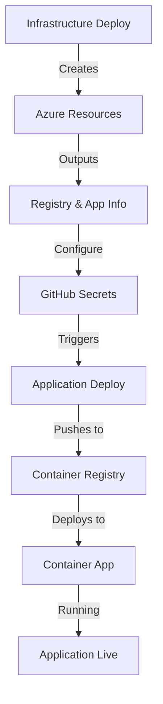

# Infrastructure Deployment - Quick Start

## 🚀 Quick Deploy

### Prerequisites
- Azure subscription
- GitHub repository with Actions enabled
- Azure credentials configured as GitHub secret

### Steps

#### 1. Configure GitHub Secrets

Add these secrets to your GitHub repository (Settings → Secrets):

```bash
AZURE_CREDENTIALS          # Service principal JSON
AZURE_PROJECT_ENDPOINT     # Azure AI endpoint
MODEL_DEPLOYMENT_NAME      # GPT-4 model name
```

#### 2. Run Infrastructure Deployment

**Option A: Via GitHub Actions UI**
1. Go to **Actions** → **Infrastructure - Deploy to Azure**
2. Click **Run workflow**
3. Select environment: `dev`, `staging`, or `production`
4. Select action: `deploy`
5. Click **Run workflow**

**Option B: Via Azure CLI**
```bash
# Login
az login

# Deploy to dev
az deployment group create \
  --name infra-deploy-$(date +%s) \
  --resource-group ai-agent-starter-dev-rg \
  --template-file infra/main.bicep \
  --parameters @infra/dev.parameters.json \
  --parameters azureProjectEndpoint="$AZURE_PROJECT_ENDPOINT" \
  --parameters modelDeploymentName="gpt-4"
```

#### 3. Get Deployment Outputs

After deployment completes:

```bash
# Get container app URL
az deployment group show \
  --name your-deployment-name \
  --resource-group ai-agent-starter-dev-rg \
  --query properties.outputs.containerAppUrl.value \
  --output tsv

# Get all outputs
az deployment group show \
  --name your-deployment-name \
  --resource-group ai-agent-starter-dev-rg \
  --query properties.outputs
```

#### 4. Update GitHub Secrets for CD Pipeline

Use the outputs to update these secrets for the CD pipeline:

```bash
AZURE_CONTAINER_REGISTRY        # From containerRegistryName output
AZURE_RESOURCE_GROUP            # Your resource group name
AZURE_CONTAINER_APP_NAME        # From containerAppName (ai-agent-starter-{env})
```

#### 5. Deploy Application

Run the **CD - Deploy to Azure Container Apps** workflow to deploy your application.

## 🔄 Complete Workflow



## 📋 Deployment Checklist

### Pre-Deployment
- [ ] Azure subscription created
- [ ] Service principal created with Contributor role
- [ ] GitHub secrets configured (AZURE_CREDENTIALS, AZURE_PROJECT_ENDPOINT)
- [ ] Resource group name decided (ai-agent-starter-{env}-rg)

### During Deployment
- [ ] Infrastructure pipeline runs successfully
- [ ] Resources created in Azure Portal
- [ ] Deployment outputs captured
- [ ] No errors in workflow logs

### Post-Deployment
- [ ] Container App URL accessible
- [ ] Health endpoint responds: `/health`
- [ ] Logs visible in Log Analytics
- [ ] Application Insights collecting data
- [ ] GitHub secrets updated with outputs
- [ ] Application deployment ready to run

## 🎯 Environment-Specific Notes

### Development
- **Scales to zero** when not in use (cost savings)
- **Smallest resources** (0.5 CPU, 1GB RAM)
- **Auto-delete** recommended after work hours
- **Cost**: ~$40-80/month with active usage

### Staging
- **Always running** (1 min replica)
- **Medium resources** (1.0 CPU, 2GB RAM)
- **Pre-production testing** environment
- **Cost**: ~$80-150/month

### Production
- **High availability** (2+ min replicas)
- **Large resources** (2.0 CPU, 4GB RAM)
- **Zone redundancy** enabled
- **Cost**: ~$200-400/month

## 🛠️ Troubleshooting

### Deployment Failed

```bash
# Check deployment operation
az deployment operation group list \
  --name your-deployment-name \
  --resource-group ai-agent-starter-dev-rg

# View specific errors
az deployment group show \
  --name your-deployment-name \
  --resource-group ai-agent-starter-dev-rg \
  --query properties.error
```

### Resources Not Created

1. Check Azure subscription limits
2. Verify service principal permissions
3. Ensure region supports Container Apps
4. Check for naming conflicts (Container Registry names are global)

### Container App Not Accessible

```bash
# Check ingress configuration
az containerapp show \
  --name ai-agent-starter-dev \
  --resource-group ai-agent-starter-dev-rg \
  --query properties.configuration.ingress

# Check replica status
az containerapp replica list \
  --name ai-agent-starter-dev \
  --resource-group ai-agent-starter-dev-rg
```

## 🗑️ Cleanup

### Delete Single Environment

```bash
# Via CLI
az group delete --name ai-agent-starter-dev-rg --yes --no-wait

# Via GitHub Actions
# Actions → Infrastructure - Deploy to Azure
# Select environment and action: "destroy"
```

### Delete All Environments

```bash
# List all resource groups
az group list --query "[?tags.Project=='ai-agent-starter'].name" -o table

# Delete all
az group list --query "[?tags.Project=='ai-agent-starter'].name" -o tsv | \
  xargs -I {} az group delete --name {} --yes --no-wait
```

## 💰 Cost Management

### Check Current Costs

```bash
# Via Azure CLI
az consumption usage list \
  --start-date 2024-01-01 \
  --end-date 2024-01-31

# Via Portal
# Cost Management + Billing → Cost analysis → Filter by tag: Project=ai-agent-starter
```

### Set Budget Alert

```bash
# Create budget (monthly)
az consumption budget create \
  --budget-name ai-agent-starter-dev-budget \
  --amount 100 \
  --time-grain Monthly \
  --start-date 2024-01-01 \
  --end-date 2024-12-31 \
  --resource-group ai-agent-starter-dev-rg
```

### Reduce Costs

1. **Scale to zero**: Set `minReplicas: 0` for dev
2. **Delete when idle**: Destroy dev overnight
3. **Use Basic SKU**: Container Registry in dev/staging
4. **Right-size**: Match CPU/memory to actual needs
5. **Monitor usage**: Review metrics weekly

## 🔗 Next Steps

After infrastructure is deployed:

1. **Deploy Application**: Run CD pipeline
2. **Configure Monitoring**: Set up alerts in Application Insights
3. **Test Endpoints**: Verify `/health`, `/docs`, `/agent_chat`
4. **Set up CI/CD**: Enable automatic deployments on push
5. **Configure Domains**: Add custom domain if needed
6. **Security Review**: Enable network policies, managed identities

## 📚 Resources

- [Full Documentation](./README.md)
- [Bicep Template](./main.bicep)
- [Azure Container Apps Docs](https://learn.microsoft.com/azure/container-apps/)
- [GitHub Actions Workflow](../.github/workflows/infra-deploy.yml)

---

**Need Help?** Check the [troubleshooting guide](./README.md#-troubleshooting) or review workflow logs in GitHub Actions.
